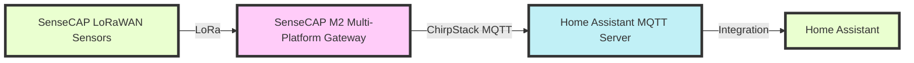

  

# SenseCAP LoRaWAN Sensors Integration with Home Assistant: Streamline Your Smart Home Setup

## Installation Guide

Simplify your smart home integration with the SenseCAP LoRaWAN sensors through our straightforward installation process. Choose between an automated installation via HACS or a manual setup.

### Automated Installation via HACS

1. Navigate to **[HACS](https://hacs.xyz/) > Integrations > Plus**.
2. Search for **Seeed Studio-SenseCAP** and select **Install**.

### Manual Setup

1. Download the `sensecap` folder from the [latest release](https://github.com/Seeed-Solution/home-assistant-SenseCAP/releases/latest).
2. Copy the folder into your Home Assistant's `/config/custom_components` directory.

## Configuration Steps

Effortlessly integrate Seeed Studio-SenseCAP sensors into your Home Assistant setup with these simple steps:

1. Go to **Settings > Integrations > Add Integration**.
2. Search for **Seeed Studio-SenseCAP**. If it's not listed, *clear your browser cache and try again*.

### Completing Integration Configuration

1. Launch the integration interface to view the default MQTT topic: `application/#`. Click **Submit** to finalize the integration settings.
2. Select **notifications** at the bottom left corner. Await the new device identification alert, then click **Check it out** to proceed to device management.
3. Follow prompts to complete all integration configurations for a seamless experience.

## Tutorial Documentation

For a detailed walkthrough and advanced configurations, visit our [Wiki page](https://wiki.seeedstudio.com/home_assistant_sensecap/).

### Integration Mechanism

The integration operates by connecting LoRa-based SenseCAP sensors to the SenseCAP M2 Multi-Platform Gateway. It utilizes the MQTT component in ChirpStack to establish a connection with the MQTT server on Home Assistant, ensuring a smooth and reliable data flow for your smart home devices.

